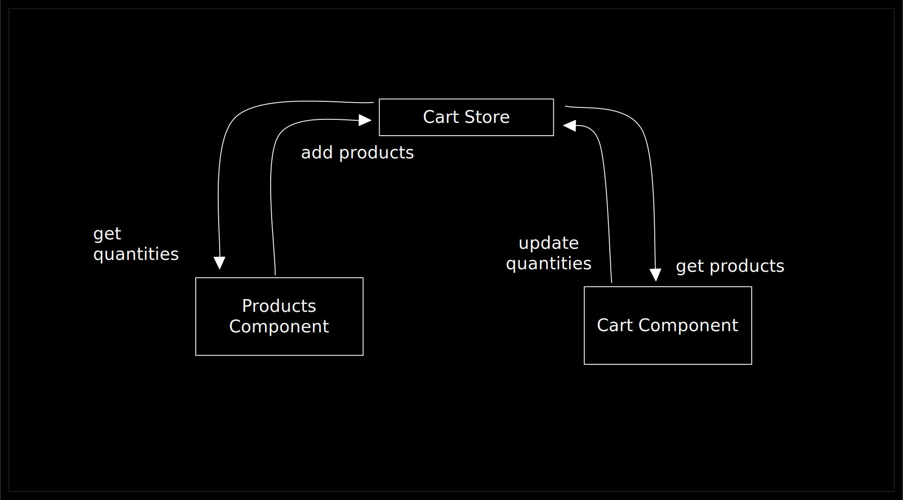

# Cart App

This app is built with React, TypeScript, Sass, CSSModules, Vite, Vitest, and
Zustand for state management.

- [Getting Started](#getting-started)
- [Technology Stack \& Decisions](#technology-stack--decisions)
- [Features](#features)
- [Architecture](#architecture)
- [Development Environment Tools](#development-environment-tools)
- [Types](#types)
- [Configuration options and tools I didn't include because the project isn't large enough](#configuration-options-and-tools-i-didnt-include-because-the-project-isnt-large-enough)

## Getting Started

1. Clone repo
2. `npm install`
3. Create `.env` and add `VITE_API_URL=https://dummyjson.com/products`

Then run the following commands as needed:

```bash
# development, building, and testing
npm run dev # dev server
npm run test # run tests
npm run build # build for production
npm run test:watch # run tests in watch mode with a browser UI

# linting, style checking, and type checking
npm run lint
npm run stylelint
npm run check
npm run tsc
```

## Technology Stack & Decisions

I used numerous tools to ensure that the code is clean, performant, and tested.
The requirements were simple enough that I didn't need to complicate the
codebase too much, while allowing me to express my experience and knowledge.
Technical decisions in the real world would depend on requirements and the
available time-frame.

- **React**: Required, but I'm also familiar with SolidJS, Vue, Next, and Qwik.
- **TypeScript**: Bonus, but is my default choice nonetheless.
- **Sass**: I prefer Sass over CSS-in-JS solutions because it is more performant
  resulting in better Developer Experience, and has a more intuitive API
  relative to vanilla.
- **CSSModules**: I prefer CSSModules over BEM or other architectures because it
  allows for styles to be scoped to a component without having to maintain a
  specific naming tree.
- **Vite**: CRA is deprecated, Parcel doesn't provide as many options, and
  Webpack is too heavy for this project. Vite is the perfect middle ground.
- **Vitest**: Great alternative to Jest with a much faster test runner and
  direct integration with Vite and the whole development environment. I
  implemented **Snapshot Testing**, **Component UI Testing**, and **Unit
  Testing**.
- **Zustand**: An extremely light-weight state management library with
  performance in mind. Removes the hassle of optimizing React Context, and has a
  much smaller development overhead than Redux and other alternatives. Also has
  native support for Redux DevTools, persistence, and other integrations.

## Features

**Required**:

- [x] Fetch products from API
- [x] List products as cards {price in GBP, title, thumbnail}
- [x] Add products to cart button on cards
- [x] List products in cart {thumbnail, quantity, title}
- [x] Increase or decrease quantity of products in cart
- [x] Remove products from cart when quantity reaches 0
- [x] Display total price of cart in GBP with discounts applied

**Stretch Goals Achieved**:

- [x] Use TypeScript
- [x] Import path aliases
- [x] Autogenerated TypeScript API types
- [x] Documented environment variables in vite-env.d.ts
- [x] Snapshot Testing
- [x] Component UI Testing
- [x] Unit Testing
- [x] Coverage Reporting
- [x] Design tokens in one place
- [x] Sass breakpoints to avoid repeating media queries numbers manually
- [x] Automatically generated type-scale that respects user preferences (using [UTOPIA](https://utopia.fyi/type/calculator/?c=320,14,1.2,1900,16,1.25,2,1,&s=0.75%7C0.5%7C0.25,1.5%7C2%7C3%7C4%7C6,s-l&g=s,xl,3xl,3))
- [x] Design & Functionality Improvements
  - [x] Toggle-able cart drawer
  - [x] Persistent cart state across sessions
  - [x] Any-screen responsive (Scales for all sizes until 320px wide)
  - [x] Cart drawer sticky on desktop to feel more integrated in the listing
  - [x] Cart displays number of items in cart in header 
  - [x] Product Cards display original and discounted price 
  - [x] Product cards indicate quantity of item in cart 
  - [x] Product cards indicate high value (15%+) discounts 

**Extras**:

## Architecture



## Development Environment Tools

- ESLint
- Prettier
- Stylelint

> On larger projects I would add **Husky** and **Lint Staged** (based on team approval)
> to the mix to ensure that all code is linted, formatted, and tested before being
> committed. I would also add a **CI pipeline** to ensure that all code is linted
> and formatted before being merged into the main branch.

## Types

I used [Quicktype](https://app.quicktype.io/) to generate the types from the
JSON response since I don't have the ability to automatically generate them. In
a larger, more formulated project I would be able to use OpenAPI specs, graphql
schemas, or other means of API type documentation to generate these types.

## Configuration options and tools I didn't include because the project isn't large enough

- SVGR to optimize SVGs
- Integration testing
- Coverage reports
- Axe-core for automated pipeline accessibility testing
- E2E automated testing
- Storybook for component development and documentation
- React Router for routing
- React Helmet for SEO
- React Query or alternatives for data fetching
- React Hook Form or alternatives for form management
- React Intl or alternatives for internationalization
